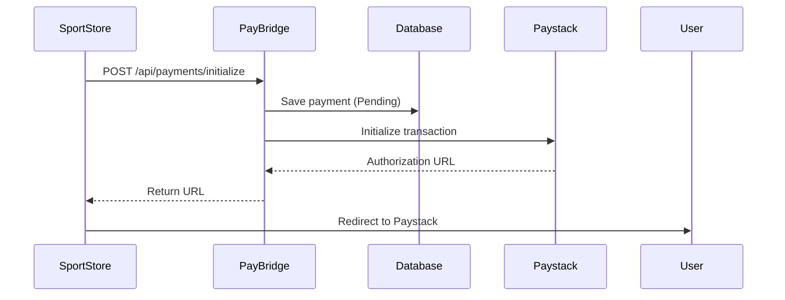
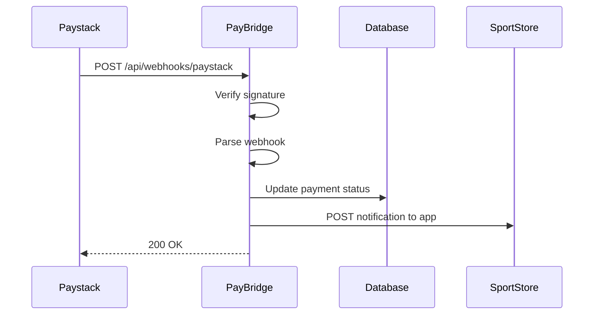

# PayBridge

A centralized payment gateway service that abstracts multiple payment providers (Paystack, Flutterwave, etc.) for your applications.

## 🎯 Overview

PayBridge acts as a unified payment interface for multiple applications ([SportStore](https://github.com/samuelcmbah/SportStore), [ExpenseVista](https://github.com/samuelcmbah/ExpenseVista.API
), etc.), allowing them to process payments through various providers without directly integrating with each provider's API.

### Key Features

- ✅ **Multi-Provider Support**: Easily switch between Paystack, Flutterwave, and other providers
- ✅ **Centralized Payment Management**: Single source of truth for all payment transactions
- ✅ **Webhook Handling**: Secure webhook processing with signature verification
- ✅ **Idempotency**: Prevents duplicate payment processing
- ✅ **Result Pattern**: Clean error handling without exceptions
- ✅ **Rich Domain Model**: Business logic encapsulated in domain entities
- ✅ **Production-Ready**: Comprehensive logging, error handling, and security measures

## 🏗️ Architecture

PayBridge follows Clean Architecture principles with clear separation of concerns:

```
PayBridge.API          → REST API endpoints
PayBridge.Application  → Business logic & DTOs
PayBridge.Domain       → Domain entities & enums
PayBridge.Infrastructure → External integrations (DB, Payment Gateways)
```

### Design Patterns Used

- **Result Pattern**: No throwing exceptions for expected failures
- **Repository Pattern**: Data access abstraction
- **Gateway Pattern**: Payment provider abstraction
- **Decorator Pattern**: Cross-cutting concerns (logging)
- **Rich Domain Model**: Business logic in entities

## 🚀 Getting Started

### Prerequisites

- .NET 8.0 SDK
- SQL Server (LocalDB or full instance)
- Paystack/Flutterwave API keys

### Configuration

1. **Update `appsettings.Development.json`:**

```json
{
  "ConnectionStrings": {
    "DefaultConnection": "Server=(localdb)\\MSSQLLocalDB;Database=PayBridgeDb;Trusted_Connection=True;MultipleActiveResultSets=true"
  },
  "Paystack": {
    "SecretKey": "sk_test_your_secret_key",
    "PublicKey": "pk_test_your_public_key",
    "WebhookSecret": "your_webhook_secret"
  }
}
```

2. **Run Database Migrations:**

```bash
cd PayBridge.API
dotnet ef database update
```

3. **Run the Application:**

```bash
dotnet run
```

The API will be available at `https://localhost:7000`

## 📋 API Documentation

### Initialize Payment

**Endpoint:** `POST /api/payments/initialize`

**Request Body:**
```json
{
  "externalUserId": "user@example.com",
  "amount": 5000.00,
  "purpose": "ProductCheckout",
  "provider": "Paystack",
  "appName": "SportStore",
  "externalReference": "ORDER-123",
  "redirectUrl": "https://sportstore.com/payment/callback",
  "notificationUrl": "https://sportstore.com/api/payment/notification"
}
```

**Response (Success):**
```json
{
  "reference": "PB_a1b2c3d4e5f6g7h8i9j0k1l2m3n4o5p6",
  "authorizationUrl": "https://checkout.paystack.com/xyz123"
}
```

**Response (Failure):**
```json
{
  "error": "Payment provider 'InvalidProvider' is not supported",
  "errorCode": "UNSUPPORTED_PROVIDER"
}
```

### Webhook Endpoint

**Endpoint:** `POST /api/webhooks/{provider}`

Examples:
- `POST /api/webhooks/paystack`
- `POST /api/webhooks/flutterwave`

**Headers:**
- `x-paystack-signature`: HMAC-SHA512 signature (for Paystack)
- `verif-hash`: Verification hash (for Flutterwave)

**Response:**
```json
{
  "received": true,
  "processed": true
}
```

## 🔐 Security Features

### 1. Webhook Signature Verification

All webhooks are verified using HMAC-SHA512 signatures:

```csharp
public Result<bool> VerifySignature(string jsonPayload, string signature)
{
    using var hmac = new HMACSHA512(Encoding.UTF8.GetBytes(_secretKey));
    var hash = hmac.ComputeHash(Encoding.UTF8.GetBytes(jsonPayload));
    var computedSignature = Convert.ToHexString(hash).ToLower();
    
    return computedSignature == signature.ToLower() 
        ? Result<bool>.Success(true)
        : Result<bool>.Failure("Invalid signature", "INVALID_SIGNATURE");
}
```

### 2. Amount Verification

Payment amounts are verified to prevent fraud:

```csharp
if (verification.Amount != payment.Amount)
{
    payment.MarkFailed();
    return WebhookResult.Failed("Amount mismatch");
}
```

### 3. Idempotency Protection

Duplicate webhooks are ignored:

```csharp
if (payment.Status != PaymentStatus.Pending)
{
    return WebhookResult.Ignored("Payment already processed");
}
```

## 💾 Database Schema

### Payment Entity

```csharp
public class Payment
{
    public Guid Id { get; private set; }
    public string Reference { get; private set; }        // PB_xxxxx
    public PaymentProvider Provider { get; private set; } // Paystack/Flutterwave
    public PaymentStatus Status { get; private set; }     // Pending/Success/Failed
    public PaymentPurpose Purpose { get; private set; }   // ProductCheckout/Subscription
    
    public decimal Amount { get; private set; }
    public string Currency { get; private set; }          // NGN
    public string ExternalUserId { get; private set; }    // User's email
    
    public string AppName { get; private set; }           // SportStore/ExpenseVista
    public string ExternalReference { get; private set; } // ORDER-123
    public string RedirectUrl { get; private set; }       // User redirect after payment
    public string NotificationUrl { get; private set; }   // Webhook to calling app
    
    public DateTime CreatedAt { get; private set; }
    public DateTime? VerifiedAt { get; private set; }
}
```

## 🔄 Payment Flow

### 1. Payment Initialization



### 2. Webhook Processing



## 🛠️ Error Handling

### Result Pattern

PayBridge uses the Result pattern instead of throwing exceptions:

```csharp
public class Result<T>
{
    public bool IsSuccess { get; }
    public T? Data { get; }
    public string? Error { get; }
    public string? ErrorCode { get; }
    
    public static Result<T> Success(T data);
    public static Result<T> Failure(string error, string? errorCode = null);
}
```

### Error Codes

| Code | Description | Action |
|------|-------------|--------|
| `UNSUPPORTED_PROVIDER` | Payment provider not configured | Check configuration |
| `DATABASE_ERROR` | Failed to save to database | Retry request |
| `GATEWAY_INITIALIZATION_ERROR` | Provider API failed | Try different provider |
| `INVALID_SIGNATURE` | Webhook signature invalid | Check webhook secret |
| `MISSING_REFERENCE` | Webhook missing reference | Log and ignore |
| `NETWORK_ERROR` | Network connectivity issue | Retry request |
| `TIMEOUT_ERROR` | Request timed out | Retry request |

### Global Exception Handler

Unhandled exceptions are caught by middleware:

```csharp
app.UseGlobalExceptionHandler();
```

## 📊 Logging Strategy

### Logging Levels

- **Information**: Successful operations, webhook received
- **Warning**: Failed operations, ignored webhooks
- **Error**: Exceptions, critical failures

### What We Log

✅ **DO log:**
- Payment initialization requests
- Webhook receipts
- External API calls
- Payment status changes
- Errors and failures

❌ **DON'T log:**
- Every method entry/exit
- Internal business logic steps
- Sensitive data (API keys, full card numbers)

### Structured Logging

```csharp
_logger.LogInformation(
    "Payment initialized - Reference: {Reference}, Amount: {Amount}, Provider: {Provider}",
    payment.Reference, 
    payment.Amount, 
    payment.Provider
);
```

## 🧪 Testing

> **Note**: Tests are not yet implemented but are planned for future development.

### Planned Test Coverage

- **Unit Tests**: Service layer business logic
- **Integration Tests**: Database operations and payment gateway integrations
- **Controller Tests**: API endpoint behavior
- **Webhook Tests**: Signature verification and webhook processing

See the [Roadmap](#-roadmap) section for testing implementation plans.

## 🔌 Adding a New Payment Provider

1. **Create Gateway Implementation:**

```csharp
public class FlutterwaveGateway : IPaymentGateway
{
    public PaymentProvider Provider => PaymentProvider.Flutterwave;
    
    public async Task<Result<PaymentInitResult>> InitializeAsync(Payment payment)
    {
        // Flutterwave-specific implementation
    }
    
    public Result<bool> VerifySignature(string jsonPayload, string signature)
    {
        // Flutterwave signature verification
    }
    
    public Result<PaymentVerificationResult> ParseWebhook(string jsonPayload)
    {
        // Flutterwave webhook parsing
    }
}
```

2. **Register in DI Container:**

```csharp
builder.Services.AddScoped<IPaymentGateway, FlutterwaveGateway>();
```

3. **Add Configuration:**

```json
{
  "Flutterwave": {
    "SecretKey": "your_secret_key",
    "PublicKey": "your_public_key",
    "WebhookSecret": "your_webhook_secret"
  }
}
```

That's it! The generic webhook controller (`/api/webhooks/flutterwave`) will automatically work.

## 🚧 Roadmap

- [ ] Add Flutterwave provider implementation
- [ ] Implement retry mechanism for failed notifications
- [ ] Add payment refund functionality
- [ ] Support for recurring payments/subscriptions
- [ ] Admin dashboard for monitoring payments
- [ ] Multi-currency support
- [ ] Payment analytics and reporting
- [ ] Rate limiting for API endpoints

## 📝 Best Practices

### 1. Use Result Pattern

```csharp
// ❌ Bad
public async Task<PaymentInitResult> InitializeAsync(Payment payment)
{
    if (error) throw new Exception("Failed");
}

// ✅ Good
public async Task<Result<PaymentInitResult>> InitializeAsync(Payment payment)
{
    if (error) return Result.Failure("Failed", "ERROR_CODE");
}
```

### 2. Encapsulate Business Logic in Domain

```csharp
// ❌ Bad - Anemic model
payment.Status = PaymentStatus.Success;
payment.VerifiedAt = DateTime.UtcNow;

// ✅ Good - Rich domain model
payment.MarkSuccessful();
```

### 3. Always Return 200 for Webhooks

```csharp
// ✅ Good - Prevents infinite retries
return Ok(new { received = true, processed = result.IsSuccess });
```

### 4. Validate at API Boundary

```csharp
// Use Data Annotations on DTOs
public record PaymentRequest
{
    [Required]
    [Range(0.01, double.MaxValue)]
    public decimal Amount { get; init; }
}
```

## 📄 License

This project is licensed under the MIT License.

## 🤝 Contributing

Contributions are welcome! Please follow these steps:

1. Fork the repository
2. Create a feature branch (`git checkout -b feature/amazing-feature`)
3. Commit your changes (`git commit -m 'Add amazing feature'`)
4. Push to the branch (`git push origin feature/amazing-feature`)
5. Open a Pull Request

## 📧 Contact

For questions or support, please open an issue on GitHub.

---

**Built with ❤️ using .NET 8 and Clean Architecture principles**
