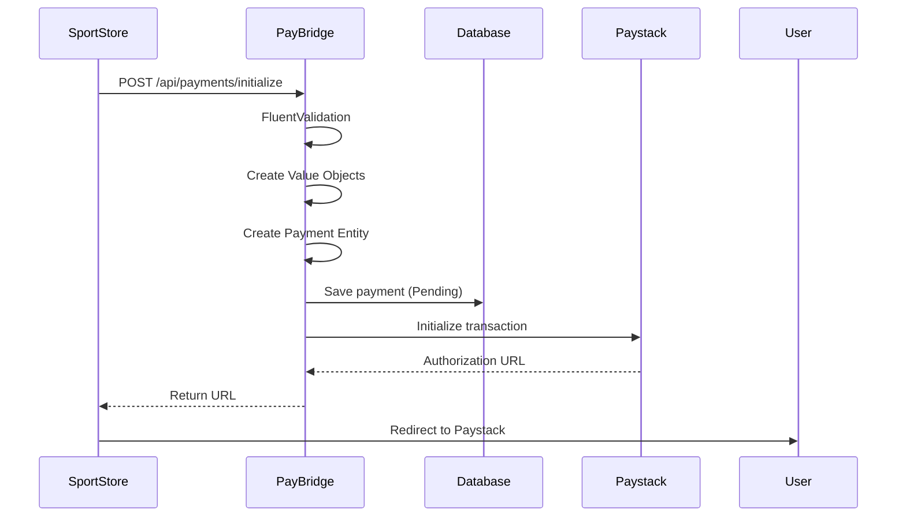
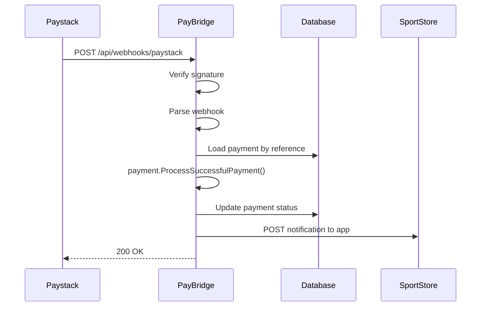

# PayBridge

A centralized payment gateway service that abstracts multiple payment providers (Paystack, Flutterwave, etc.) for your applications, built with Domain-Driven Design principles and Clean Architecture.

## 🎯 Overview

PayBridge acts as a unified payment interface for multiple applications ([SportStore](https://github.com/samuelcmbah/SportStore), [ExpenseVista](https://github.com/samuelcmbah/ExpenseVista.API), etc.), allowing them to process payments through various providers without directly integrating with each provider's API.

### Key Features

- ✅ **Multi-Provider Support**: Easily switch between Paystack, Flutterwave, and other providers
- ✅ **Rich Domain Model**: Value Objects and domain entities with encapsulated business logic
- ✅ **Centralized Payment Management**: Single source of truth for all payment transactions
- ✅ **Webhook Handling**: Secure webhook processing with signature verification
- ✅ **Idempotency**: Prevents duplicate payment processing
- ✅ **Result Pattern**: Clean error handling without exceptions
- ✅ **FluentValidation**: Declarative validation with clear error messages
- ✅ **Typed HttpClient**: Strongly-typed, testable HTTP clients
- ✅ **Global Exception Handling**: Consistent error responses using RFC 7807
- ✅ **Comprehensive Testing**: Unit tests with xUnit, NSubstitute, and FluentAssertions
- ✅ **Production-Ready**: Comprehensive logging, error handling, and security measures

## 🏗️ Architecture

PayBridge follows Clean Architecture principles with clear separation of concerns:

```
PayBridge.API          → REST API endpoints, controllers, global exception handlers
PayBridge.Application  → Business logic, DTOs, services, FluentValidation validators
PayBridge.Domain       → Domain entities, value objects, domain exceptions, enums
PayBridge.Infrastructure → External integrations (DB, Payment Gateways, Typed HttpClients)
PayBridge.Tests        → Unit tests (Domain, Application layers)
```

### Design Patterns Used

- **Value Objects**: Immutable objects with validation (Money, Email, Url, PaymentReference)
- **Rich Domain Model**: Business logic encapsulated in entities, not anemic data containers
- **Result Pattern**: No throwing exceptions for expected failures
- **Repository Pattern**: Data access abstraction
- **Gateway Pattern**: Payment provider abstraction
- **Typed HttpClient Pattern**: Strongly-typed HTTP clients with DI configuration
- **Global Exception Handler**: Centralized error handling using IExceptionHandler

## 💎 Domain Model Highlights

### Value Objects

PayBridge uses Value Objects to make illegal states unrepresentable:

```csharp
// Money - Validates amount and currency at creation
var amount = Money.Create(1000m, "NGN");  // ✅ Valid
var invalid = Money.Create(-100m, "NGN"); // ❌ Throws InvalidMoneyException

// Email - Validates and normalizes email addresses
var email = Email.Create("user@example.com"); // ✅ Valid
var bad = Email.Create("not-an-email");       // ❌ Throws InvalidEmailException

// Url - Ensures only valid HTTP/HTTPS URLs
var url = Url.Create("https://example.com/callback"); // ✅ Valid
var bad = Url.Create("ftp://example.com");            // ❌ Throws InvalidUrlException

// PaymentReference - Generates unique, validated references
var reference = PaymentReference.Generate(); // "PB_a1b2c3d4..."
```

**Why Value Objects?**
- Validation happens once at creation, not scattered everywhere
- Type-safe operations (can't add NGN to USD)
- Self-documenting code
- Prevents primitive obsession

### Rich Domain Entities

Instead of anemic models where services manipulate state:

```csharp
// ❌ Anemic Model
payment.Status = PaymentStatus.Success;
payment.VerifiedAt = DateTime.UtcNow;

// ✅ Rich Domain Model
payment.ProcessSuccessfulPayment(receivedAmount); // Validates amount & enforces state transitions
```

The Payment entity enforces business rules:
- Amount verification (prevents fraud)
- Valid state transitions (can't mark failed payment as successful)
- Immutable reference generation

## 🚀 Getting Started

### Prerequisites

- .NET 8.0 SDK
- SQL Server (LocalDB or full instance)
- Paystack/Flutterwave API keys

### Configuration

1. **Update `appsettings.Development.json`:**

```json
{
  "ConnectionStrings": {
    "DefaultConnection": "Server=(localdb)\\MSSQLLocalDB;Database=PayBridgeDb;Trusted_Connection=True;MultipleActiveResultSets=true"
  },
  "Paystack": {
    "BaseUrl": "https://api.paystack.co/",
    "SecretKey": "sk_test_your_secret_key",
    "PublicKey": "pk_test_your_public_key",
    "WebhookSecret": "your_webhook_secret"
  }
}
```

2. **Run Database Migrations:**

```bash
cd PayBridge.API
dotnet ef database update
```

3. **Run the Application:**

```bash
dotnet run
```

The API will be available at `https://localhost:7000`

4. **Run Tests:**

```bash
cd PayBridge.Tests
dotnet test
```

## 📋 API Documentation

### Initialize Payment

**Endpoint:** `POST /api/payments/initialize`

**Request Body:**
```json
{
  "externalUserId": "user@example.com",
  "amount": 5000.00,
  "purpose": "ProductCheckout",
  "provider": "Paystack",
  "appName": "SportStore",
  "externalReference": "ORDER-123",
  "redirectUrl": "https://sportstore.com/payment/callback",
  "notificationUrl": "https://sportstore.com/api/payment/notification"
}
```

**Response (Success):**
```json
{
  "reference": "PB_a1b2c3d4e5f6g7h8i9j0k1l2m3n4o5p6",
  "authorizationUrl": "https://checkout.paystack.com/xyz123"
}
```

**Response (Validation Error - FluentValidation):**
```json
{
  "errors": [
    {
      "property": "Amount",
      "message": "Amount must be greater than zero",
      "errorCode": "GreaterThanValidator"
    }
  ]
}
```

**Response (Domain Error):**
```json
{
  "error": "Amount must be greater than zero",
  "errorCode": "AMOUNT_NOT_POSITIVE"
}
```

**Response (Failure):**
```json
{
  "error": "Payment provider 'InvalidProvider' is not supported",
  "errorCode": "UNSUPPORTED_PROVIDER"
}
```

### Webhook Endpoint

**Endpoint:** `POST /api/webhooks/{provider}`

Examples:
- `POST /api/webhooks/paystack`
- `POST /api/webhooks/flutterwave`

**Headers:**
- `x-paystack-signature`: HMAC-SHA512 signature (for Paystack)
- `verif-hash`: Verification hash (for Flutterwave)

**Response:**
```json
{
  "received": true,
  "processed": true
}
```

## 🔐 Security Features

### 1. Webhook Signature Verification

All webhooks are verified using HMAC-SHA512 signatures:

```csharp
public Result<bool> VerifySignature(string jsonPayload, string signature)
{
    using var hmac = new HMACSHA512(Encoding.UTF8.GetBytes(_secretKey));
    var hash = hmac.ComputeHash(Encoding.UTF8.GetBytes(jsonPayload));
    var computedSignature = Convert.ToHexString(hash).ToLower();
    
    return computedSignature == signature.ToLower() 
        ? Result<bool>.Success(true)
        : Result<bool>.Failure("Invalid signature", "INVALID_SIGNATURE");
}
```

### 2. Amount Verification

Payment amounts are verified using Value Objects to prevent fraud:

```csharp
public void ProcessSuccessfulPayment(Money receivedAmount)
{
    if (!receivedAmount.Equals(Amount))
    {
        MarkFailed();
        throw new PaymentAmountMismatchException();
    }
    MarkSuccessful();
}
```

### 3. Idempotency Protection

Duplicate webhooks are ignored:

```csharp
if (payment.Status != PaymentStatus.Pending)
{
    return WebhookResult.Ignored("Payment already processed");
}
```

### 4. Optimistic Concurrency

Database uses row versioning to prevent race conditions:

```csharp
entity.Property<byte[]>("RowVersion")
    .IsRowVersion()
    .IsRequired();
```

## 💾 Database Schema

### Payment Entity

```csharp
public class Payment
{
    public Guid Id { get; private set; }
    public PaymentReference Reference { get; private set; }   // PB_xxxxx (Value Object)
    public PaymentProvider Provider { get; private set; }     // Paystack/Flutterwave
    public PaymentStatus Status { get; private set; }         // Pending/Success/Failed
    public PaymentPurpose Purpose { get; private set; }       // ProductCheckout/Subscription
    
    public Money Amount { get; private set; }                 // Value Object (amount + currency)
    public Email ExternalUserId { get; private set; }         // Value Object (validated email)
    
    public string AppName { get; private set; }               // SportStore/ExpenseVista
    public string ExternalReference { get; private set; }     // ORDER-123
    public Url RedirectUrl { get; private set; }              // Value Object (validated URL)
    public Url NotificationUrl { get; private set; }          // Value Object (validated URL)
    
    public DateTime CreatedAt { get; private set; }
    public DateTime? VerifiedAt { get; private set; }
    
    // Business logic methods (Rich Domain Model)
    public void ProcessSuccessfulPayment(Money receivedAmount) { /*...*/ }
    public void MarkInitializationFailed() { /*...*/ }
}
```

## 🔄 Payment Flow

### 1. Payment Initialization



### 2. Webhook Processing



## 🛠️ Error Handling

### Three-Layer Strategy

1. **Domain Layer**: Throws domain exceptions for business rule violations
2. **Application Layer**: Catches domain exceptions, returns Result<T>
3. **API Layer**: Global exception handler converts uncaught exceptions to Problem Details

### Result Pattern

PayBridge uses the Result pattern instead of throwing exceptions for expected failures:

```csharp
public class Result<T>
{
    public bool IsSuccess { get; }
    public T? Data { get; }
    public string? Error { get; }
    public string? ErrorCode { get; }
    
    public static Result<T> Success(T data);
    public static Result<T> Failure(string error, string? errorCode = null);
}
```

### Global Exception Handler

Unhandled exceptions are caught by ASP.NET Core 8's `IExceptionHandler`:

```csharp
public class GlobalExceptionHandler : IExceptionHandler
{
    public async ValueTask<bool> TryHandleAsync(HttpContext httpContext, Exception exception, ...)
    {
        var problemDetails = exception switch
        {
            DomainException ex => new ProblemDetails { Status = 400, ... },
            ArgumentException ex => new ProblemDetails { Status = 400, ... },
            _ => new ProblemDetails { Status = 500, ... }
        };
        
        await httpContext.Response.WriteAsJsonAsync(problemDetails);
        return true;
    }
}
```

**Benefits:**
- Consistent error responses (RFC 7807 Problem Details)
- No try-catch blocks in controllers
- Production-safe error messages

### Error Codes

| Code | Description | Action |
|------|-------------|--------|
| `UNSUPPORTED_PROVIDER` | Payment provider not configured | Check configuration |
| `DATABASE_ERROR` | Failed to save to database | Retry request |
| `GATEWAY_INITIALIZATION_ERROR` | Provider API failed | Try different provider |
| `INVALID_SIGNATURE` | Webhook signature invalid | Check webhook secret |
| `MISSING_REFERENCE` | Webhook missing reference | Log and ignore |
| `NETWORK_ERROR` | Network connectivity issue | Retry request |
| `TIMEOUT_ERROR` | Request timed out | Retry request |
| `AMOUNT_NOT_POSITIVE` | Amount is zero or negative | Fix amount |
| `AMOUNT_MISMATCH` | Webhook amount ≠ expected | Investigate fraud |
| `INVALID_PAYMENT_STATE` | Invalid state transition | Check payment status |

## 🧪 Testing

PayBridge includes comprehensive unit tests using:
- **xUnit**: Test framework
- **NSubstitute**: Mocking library for dependencies
- **FluentAssertions**: Readable, expressive assertions

### Test Coverage

- ✅ **Value Objects**: Money, Email, Url, PaymentReference creation and operations
- ✅ **Domain Entities**: Payment state transitions and business logic
- ✅ **Application Services**: PaymentService initialization and webhook handling
- ✅ **Validation**: FluentValidation rules

### Example Tests

**Testing Value Objects:**
```csharp
[Fact]
public void Create_WithValidAmount_ShouldSucceed()
{
    var money = Money.Create(100.50m, "NGN");
    
    money.Amount.Should().Be(100.5m);
    money.Currency.Should().Be("NGN");
}

[Fact]
public void Add_WithDifferentCurrencies_ShouldThrowInvalidMoneyException()
{
    var ngn = Money.Create(100m, "NGN");
    var usd = Money.Create(50m, "USD");
    
    var act = () => ngn.Add(usd);
    
    act.Should().Throw<InvalidMoneyException>()
        .WithMessage("Cannot add money with different currencies");
}
```

**Testing Domain Entities:**
```csharp
[Fact]
public void ProcessSuccessfulPayment_WithMismatchedAmount_ShouldMarkAsFailedAndThrow()
{
    var payment = CreateValidPayment(amount: 1000m);
    var wrongAmount = Money.Create(500m, "NGN");
    
    var act = () => payment.ProcessSuccessfulPayment(wrongAmount);
    
    act.Should().Throw<PaymentAmountMismatchException>();
    payment.Status.Should().Be(PaymentStatus.Failed);
}
```

**Testing Application Services (with NSubstitute):**
```csharp
[Fact]
public async Task InitializePaymentAsync_WithValidRequest_ShouldSucceed()
{
    // Arrange
    var request = CreateValidRequest();
    _mockGateway
        .InitializeAsync(Arg.Any<Payment>())
        .Returns(Result<PaymentInitResult>.Success(new PaymentInitResult(...)));
    
    // Act
    var result = await _sut.InitializePaymentAsync(request);
    
    // Assert
    result.IsSuccess.Should().BeTrue();
    await _mockRepository.Received(1).AddAsync(Arg.Any<Payment>());
}
```

## 📊 Logging Strategy

### Logging Levels

- **Information**: Successful operations, webhook received
- **Warning**: Failed operations, ignored webhooks, domain exceptions
- **Error**: Unexpected exceptions, critical failures

### What We Log

✅ **DO log:**
- Payment initialization requests
- Webhook receipts
- External API calls
- Payment status changes
- Errors and failures

❌ **DON'T log:**
- Every method entry/exit
- Internal business logic steps
- Sensitive data (API keys, full card numbers)

### Structured Logging with Serilog

```csharp
_logger.LogInformation(
    "Payment initialized - Reference: {Reference}, Amount: {Amount}, Provider: {Provider}",
    payment.Reference.Value, 
    payment.Amount, 
    payment.Provider
);
```

## 🔌 Adding a New Payment Provider

1. **Create Gateway Implementation:**

```csharp
public class FlutterwaveGateway : IPaymentGateway
{
    public PaymentProvider Provider => PaymentProvider.Flutterwave;
    
    public async Task<Result<PaymentInitResult>> InitializeAsync(Payment payment)
    {
        // Flutterwave-specific implementation
    }
    
    public Result<bool> VerifySignature(string jsonPayload, string signature)
    {
        // Flutterwave signature verification
    }
    
    public Result<PaymentVerificationResult> ParseWebhook(string jsonPayload)
    {
        // Flutterwave webhook parsing
    }
}
```

2. **Create Typed HttpClient:**

```csharp
public class FlutterwaveHttpClient
{
    private readonly HttpClient _httpClient;
    
    public FlutterwaveHttpClient(HttpClient httpClient)
    {
        _httpClient = httpClient;
    }
    
    public Task<HttpResponseMessage> InitializePaymentAsync(object payload)
    {
        return _httpClient.PostAsJsonAsync("payments", payload);
    }
}
```

3. **Register in DI Container:**

```csharp
// Configure typed HttpClient
builder.Services.AddHttpClient<FlutterwaveHttpClient>((sp, client) =>
{
    var settings = sp.GetRequiredService<IOptions<FlutterwaveSettings>>().Value;
    client.BaseAddress = new Uri(settings.BaseUrl);
    client.DefaultRequestHeaders.Add("Authorization", $"Bearer {settings.SecretKey}");
    client.Timeout = TimeSpan.FromSeconds(30);
});

builder.Services.AddScoped<IPaymentGateway, FlutterwaveGateway>();
```

4. **Add Configuration:**

```json
{
  "Flutterwave": {
    "BaseUrl": "https://api.flutterwave.com/v3/",
    "SecretKey": "your_secret_key",
    "PublicKey": "your_public_key",
    "WebhookSecret": "your_webhook_secret"
  }
}
```

That's it! The generic webhook controller (`/api/webhooks/flutterwave`) will automatically work.

## 🚧 Roadmap

### Completed ✅
- [x] Rich domain model with Value Objects
- [x] FluentValidation for request validation
- [x] Typed HttpClient for payment gateways
- [x] Global exception handler
- [x] Result pattern for error handling
- [x] Comprehensive unit tests
- [x] Paystack integration

### Planned 📋
- [ ] Add Flutterwave provider implementation
- [ ] Implement retry mechanism for failed notifications
- [ ] Add payment refund functionality
- [ ] Support for recurring payments/subscriptions
- [ ] Admin dashboard for monitoring payments
- [ ] Multi-currency support
- [ ] Payment analytics and reporting
- [ ] Rate limiting for API endpoints
- [ ] Integration tests
- [ ] CI/CD pipeline

## 📝 Best Practices

### 1. Value Objects Over Primitives

```csharp
// ❌ Primitive Obsession
public class Payment
{
    public decimal Amount { get; set; }
    public string Currency { get; set; }
}

// ✅ Value Objects
public class Payment
{
    public Money Amount { get; private set; }
}
```

### 2. Rich Domain Model Over Anemic Model

```csharp
// ❌ Anemic model
payment.Status = PaymentStatus.Success;
payment.VerifiedAt = DateTime.UtcNow;

// ✅ Rich domain model
payment.ProcessSuccessfulPayment(receivedAmount);
```

### 3. Result Pattern Over Exceptions

```csharp
// ❌ Exception-based (for expected failures)
public async Task<PaymentInitResult> InitializeAsync(Payment payment)
{
    if (error) throw new Exception("Failed");
}

// ✅ Result pattern
public async Task<Result<PaymentInitResult>> InitializeAsync(Payment payment)
{
    if (error) return Result.Failure("Failed", "ERROR_CODE");
}
```

### 4. FluentValidation Over Data Annotations

```csharp
// ❌ Data Annotations (limited)
public record PaymentRequest
{
    [Required]
    [Range(0.01, double.MaxValue)]
    public decimal Amount { get; init; }
}

// ✅ FluentValidation (powerful, testable)
public class PaymentRequestValidator : AbstractValidator<PaymentRequest>
{
    public PaymentRequestValidator()
    {
        RuleFor(x => x.Amount)
            .GreaterThan(0)
            .WithMessage("Amount must be greater than zero")
            .LessThanOrEqualTo(100_000_000)
            .WithMessage("Amount cannot exceed 100,000,000");
    }
}
```

### 5. Typed HttpClient Over Direct Injection

```csharp
// ❌ Direct HttpClient (tight coupling, hard to test)
public PaystackGateway(HttpClient httpClient)
{
    httpClient.BaseAddress = new Uri("...");
}

// ✅ Typed HttpClient (configured via DI)
public PaystackGateway(PaystackHttpClient httpClient)
{
    _httpClient = httpClient; // Pre-configured
}
```

### 6. Always Return 200 for Webhooks

```csharp
// ✅ Good - Prevents infinite retries
return Ok(new { received = true, processed = result.IsSuccess });
```

## 📄 License

This project is licensed under the MIT License.

## 🤝 Contributing

Contributions are welcome! Please follow these steps:

1. Fork the repository
2. Create a feature branch (`git checkout -b feature/amazing-feature`)
3. Commit your changes (`git commit -m 'Add amazing feature'`)
4. Push to the branch (`git push origin feature/amazing-feature`)
5. Open a Pull Request

## 🧑‍💻 Author

* **Samuel Mbah**
* GitHub: [@samuelcmbah](https://github.com/samuelcmbah)
* LinkedIn: [Samuel Mbah](https://linkedin.com/in/samuelcmbah)

---

**Built with ❤️ using .NET 8, Domain-Driven Design, and Clean Architecture principles**
